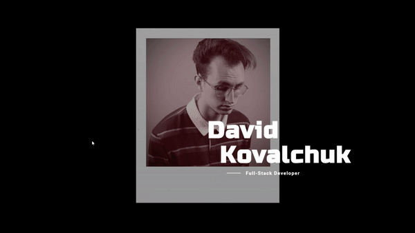

# better-portfolio
## Description
    
better-portfolio is a portfolio page I created experimenting with parallax scrolling to create that really nice looking scroll effect on a webpage. The page itself has a very minimalistic style with an about me section, projects, skills, and contact section. 
## Table of Contents
- [Contributions](#contributions) 
- [Installation](#Installation) 
- [Website_Screenshot](#website_screenshot)
- [Link](#link)
- [Questions](#questions) 
## Contributions

David Kovalchuk
## Installation
When trying to run the code, you will first need to "npm install" in the terminal in order to work.

## Website_Screenshot

## Link
https://davidmnml.netlify.app/
## Questions
You can reach me on GitHub at [itsDavidK](https://github.com/itsDavidK).
